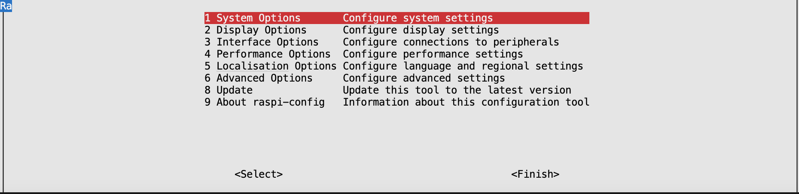

Ik ga in dit bestand uit van een unix-achtig systeem. Ik heb zelf gewerkt vanuit MacOS, maar alle commandos moeten ook vanuit Linux werken.

## Bouwen van de kernel
Voor deze opdracht heb ik gebruik gemaakt van de [rpi-rt-kernel](https://github.com/remusmp/rpi-rt-kernel) repository. Deze repository heb ik geforkt omdat er een probleem was met de usb driver. De patch hiervoor heb ik gekopieerd van [deze commit](https://www.osadl.org/monitoring/patches/rbs3s/usb-dwc_otg-fix-system-lockup-when-interrupts-are-threaded.patch.html). Ik in de [Dockerfile](https://github.com/koenichiwa/rpi-rt-kernel/blob/master/Dockerfile) aanpassingen gemaakt zodat de patch wordt doorgevoerd voor zowel kernel versie 5 als 6. De diff van de fork is [hier](https://github.com/remusmp/rpi-rt-kernel/compare/master...koenichiwa:rpi-rt-kernel:master#diff-dd2c0eb6ea5cfc6c4bd4eac30934e2d5746747af48fef6da689e85b752f39557) te zien. Daarnaast heb ik een nieuw argument toegevoegd, `NO_RT` zodat ik met dezelfde Dockerfile ook een standaard versie van de kernel kan bouwen. Waar de versie kan in de Dockerfile worden aangepast wordt getoond in de volgende afbeelding, maar ik heb voor deze test v6.6 gebruikt.
<p align="center">
    
</p>

De keuze of de realtime versie van de kernel gebruikt wordt of niet kan simpelweg gedaan worden met de commandos: `export NO_RT=1` of `unset NO_RT`. Wanneer `NO_RT` gedefinieerd is dan wordt de real-time patch en de usb-driver patch niet uitgevoerd, en blijven de kernel configuraties op default. Dit wordt getoond in de volgende afbeelding.

<p align="center">
    
</p>

Om de kernel te installeren moet docker op de computer geinstalleerd staan. De installatie instructies zijn op de [site van Docker](https://docs.docker.com/engine/install/) te vinden. Om de kernel te installeren can het volgende commando uitgevoerd worden:

```git clone git@github.com:koenichiwa/rpi-rt-kernel.git && cd "$(basename "$_" .git) && make Pi3```

Ik heb enige aanpassingen gedaan in de Makefile, om de juiste argumenten aan de Docker build mee te geven. Wanneer de build is afgelopen komt er een zip bestand in de build directory te staan. Wanneer deze wordt ge-unzipt kan de gegenereerde img gebruikt worden om op de SD-kaart te installeren. De installatie heb ik zelf gedaan met [Raspberry Imager](https://www.raspberrypi.com/software/), maar het is ook mogelijk om [dd](https://man7.org/linux/man-pages/man1/dd.1.html) te gebruiken.

Raspberry Imager heeft de optie om direct de hostname, username, ssh en wifi instellingen te doen. Al heb ik dit uiteindelijk handmatig gedaan.

<p align="center">
    
</p>

## Instellen en testen van de Raspberry Pi
Gelukkig had ik zelf een scherm waarvan ik gebruik kon maken om de eerste instellingen op de Raspberry Pi (RPI) te doen. Eerst heb ik de libraries en binaries geinstalleerd die ik nodig had voor het project:

```sudo apt update && sudo apt upgrade -y && sudo apt install git pigpio libnuma-dev gnuplot -y```

Vervolgens heb ik de configuratie aangepast met het volgende commando.

```sudo raspi-config```

<p align="center">
    
</p>
<p align="center">
    
</p>
<p align="center">
    
</p>

Dit was enkel om de wifi en hostname in te stellen en de ssh aan te zetten. Hierna heb ik op mijn eigen PC geconnect met de RPI met `ssh koen@koenvanwel` en, omdat het een gedeelte van de opdracht was, heb ik getest of `uname -a` ook mijn naam toonde. De rest van de commandos zullen op de RPI worden uitgevoerd.

<p align="center">
    
</p>

Daarna moest had ik een ssh key nodig om in de git repositories te komen. De output hiervan heb ik aan mijn github keychain toegevoegd.
```ssh-keygen -t rsa -f ~/.ssh/id_rsa -N "" -q && cat ~/.ssh/id_rsa.pub```

Vervolgens moest ik definieren wat de output directory was voor de komende tests.
```export OUTPUT_DIR=NO_RT6```

Vervolgens ik heb mijn eigen test gecloned. In deze test wordt de output van pin 24 getoggled en wordt het moment van schrijven opgeslagen. Pin 23 heeft een interrupt die die bij zowel een rising als falling edge wordt uitgevoerd. Op dat moment wordt de duratie in nanoseconden tussen de toggle en de interupt berekend en opgeslagen. Op het moment dat een toggle wordt gemist, dan wordt er een duratie van -1 geschreven. Dit wordt 100*100000 uitgevoerd en er worden 100 csv bestanden gegenereerd. De code en de uitkomst zijn te vinden in [mijn repository](https://github.com/koenichiwa/rpi_pins_c).
```cd ~/ && git clone git@github.com:koenichiwa/rpi_pins_c.git && cd "$(basename "$_" .git)" && sudo make run OUTPUT_DIR=$OUTPUT_DIR```

<p align="center">
    
</p>

Toen deze test klaar was heb ik versie 1.10 van `rt-tests` gebruikt om de cyclictest te draaien. Dit heb ik gebouwd met het volgende commando:

```cd ~/ && git clone https://git.kernel.org/pub/scm/utils/rt-tests/rt-tests.git && cd "$(basename "$_" .git)" && git fetch --all --tags && git checkout tags/v1.10 -b 1.10-branch && make```

<p align="center">
    
</p> 

En uitgevoerd met de volgende commandos:

`~/rpi_pins_c/$OUTPUT_DIR/cyclic_test_output`

```sudo ./cyclictest -l100000000 -m -S -p90 -i200 -h400 -q | cat > ~/rpi_pins_c/$OUTPUT_DIR/cyclictest_output```

## Test data
Toen deze tests waren uitgevoerd heb ik `create_histogram.sh` in mijn `rpi_pins_c` repository gebruikt om van de data een histogram te maken. De code ervan heb ik gebaseerd op [deze post van OSADL](https://www.osadl.org/Create-a-latency-plot-from-cyclictest-hi.bash-script-for-latency-plot.0.html?&no_cache=1&sword_list[0]=script). Deze plots heb ik met `gnuplot` op de RPI zelf gemaakt, aangezien dat programma om een duistere reden niet op mijn PC werkte.

`sudo ./create_histogram.sh $OUTPUT_DIR/cyclictest_output 4`

<p align="center">
    
</p>

<p align="center">
    
</p>

<p align="center">
    
</p>


